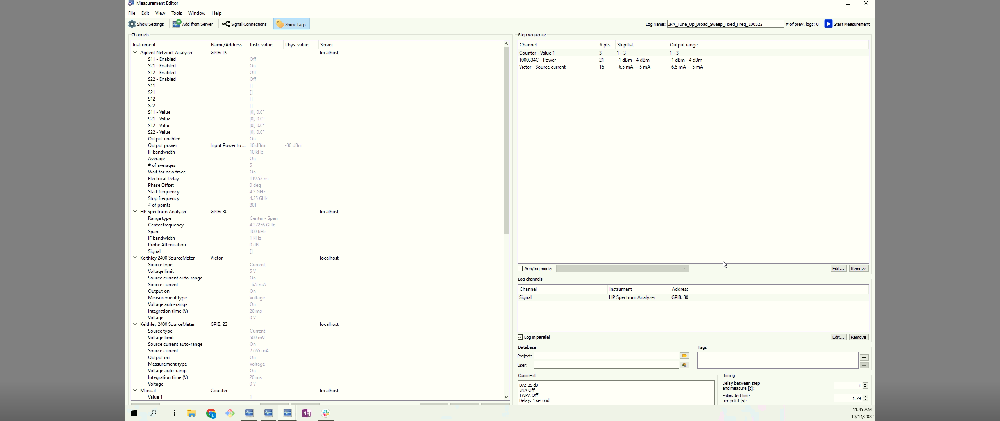
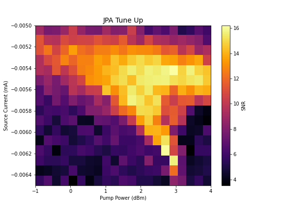

# JPA TUNE UP CODE:

# Usage:

0. Take data using Measurement Browser through Labber with the following loop order
```
Counter Value (number of SA traces to consider -> used for calculating average SNR)
Power Bounds
Source Current Bounds
```

1. Change Labber Channel Names in the `tune_up_jpa_power_current_only.py`


2. `$ python tune_up_jpa_power_current_only.py`

or ** Run on Spyder **


---

## Example Usage:

**Labber Measurement Window:**




```shell
$ python tune_up_jpa_power_current_only.py

Labber File Location: G:\Shared drives\Labber\Data\2022\10\Data_1005\JPA_Tune_Up_Broad_Sweep_Fixed_Freq_100522.hdf5

Number of Repeations: 3

Number of Points for Power: 21

Number of Points for Source Current: 16
```


**Result**


